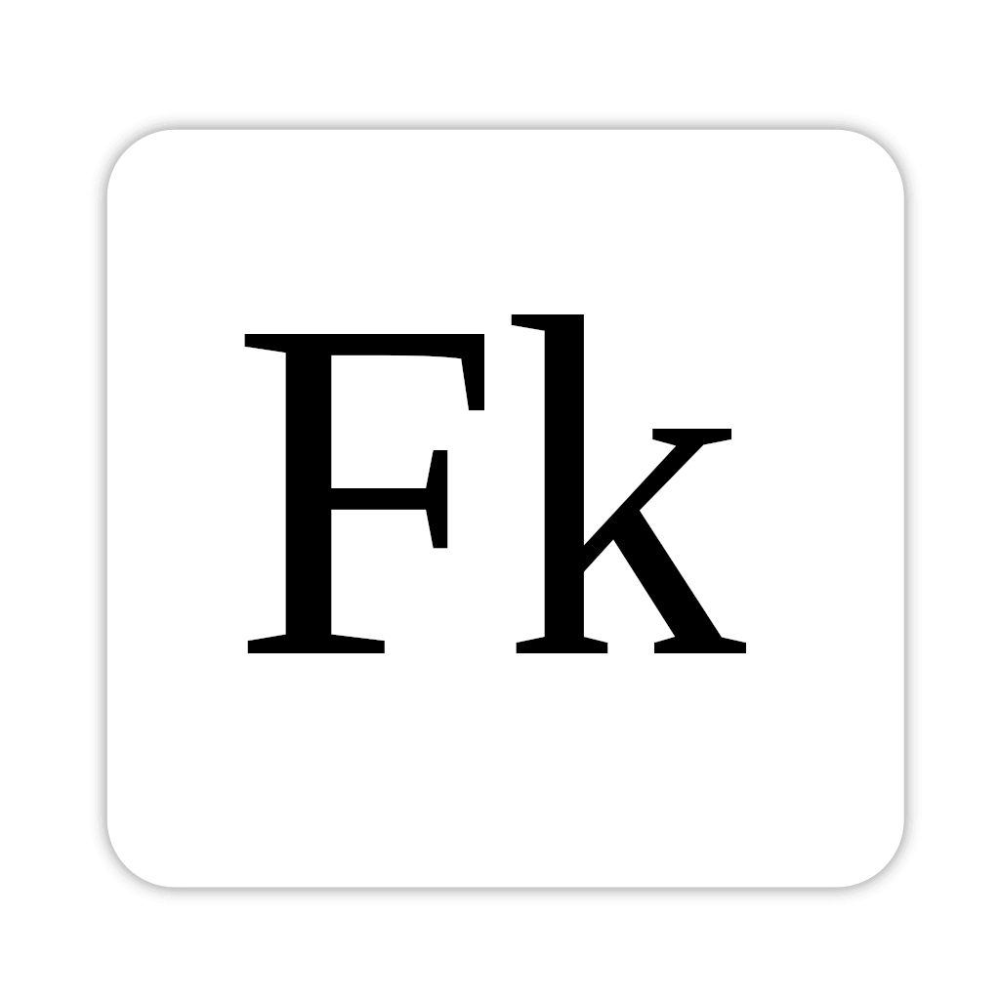

<p align="center">
  
</p>

<h1 align="center">
Fokus
</h1>

A minimalist, distraction-free fullscreen text editor built with [Wails](https://wails.io) (Go + web frontend). The window is frameless and fullscreen, with a centered serif text column on a black background.

The goal is a lightweight, easily customizable editor that runs across Linux, Windows, and macOS. It is inspired by [FocusWriter](https://gottcode.org/focuswriter/), which currently lacks an easy macOS installation path and has some long-standing unresolved issues.

## Requirements

- **Go** 1.18 or later
- **Node.js** 15 or later (with `npm`)
- **Wails CLI** v2
- Platform-specific dependencies (see below)

### Linux (Ubuntu / Debian)

```bash
sudo apt install build-essential pkg-config libgtk-3-dev libwebkit2gtk-4.1-dev
```

On Ubuntu 24.04+ the `webkit2gtk-4.0` package no longer exists, so the `4.1` package is used and the `webkit2_41` build tag must be passed to `wails`.

### macOS

```bash
xcode-select --install
```

### Windows

Install the [WebView2 runtime](https://developer.microsoft.com/microsoft-edge/webview2/) (already present on Windows 11).

### Install the Wails CLI

```bash
go install github.com/wailsapp/wails/v2/cmd/wails@latest
```

Make sure `$(go env GOPATH)/bin` is on your `PATH`:

```bash
export PATH=$PATH:$(go env GOPATH)/bin
```

Verify everything is in place:

```bash
wails doctor
```

## Setup

Clone the repository, then install the frontend dependencies:

```bash
git clone <repo-url> fokus-editor
cd fokus-editor
cd frontend && npm install && cd ..
```

## Live Development

Run a hot-reloading dev server (Vite for the frontend, recompiles Go on change):

```bash
wails dev -tags webkit2_41   # Linux (Ubuntu 24.04+)
wails dev                    # macOS / Windows / older Linux
```

A browser dev server is also available at <http://localhost:34115> where Go-bound methods are callable from DevTools.

> The app launches frameless and fullscreen — there is no close button. Quit with **Alt+F4** (Linux/Windows) / **Cmd+Q** (macOS), or kill the `wails` process from the terminal.

## Building

Produce a redistributable binary in `build/bin/`:

```bash
wails build -tags webkit2_41   # Linux (Ubuntu 24.04+)
wails build                    # macOS / Windows / older Linux
```

Run the resulting binary:

```bash
./build/bin/fokus-editor
```

## Packaging for macOS

On macOS, `wails build` produces an app **bundle** (`build/bin/Fokus.app`),
which is a folder — not a single file. To share it (e.g. on the releases page),
wrap it in a `.dmg` so the bundle structure and permissions are preserved:

```bash
hdiutil create -volname Fokus \
  -srcfolder build/bin/Fokus.app \
  -ov -format UDZO build/bin/Fokus.dmg
```

> The app is **not code-signed or notarized**, so macOS Gatekeeper will block
> it on first launch after download. See below to open it anyway. For
> distribution to others without warnings, sign with an Apple Developer ID and
> notarize the bundle.

## Running on macOS (Gatekeeper)

Because the app is unsigned, a copy downloaded from the internet is quarantined
and macOS refuses to open it (often reporting it as "damaged"). To open it
anyway, strip the quarantine attribute after copying `Fokus.app` to
`/Applications` (or wherever you keep it):

```bash
xattr -dr com.apple.quarantine /Applications/Fokus.app
```

The app then launches normally. (Right-clicking the app and choosing **Open**
also works on some macOS versions, but the command above is the reliable fix.)

## Project Structure

```
fokus-editor/
├── main.go              # Wails app entry: window options (fullscreen, frameless, black bg)
├── app.go               # App struct bound to the frontend
├── wails.json           # Wails project config
├── go.mod / go.sum
└── frontend/
    ├── index.html       # Single <textarea id="editor">
    ├── package.json
    └── src/
        ├── main.js      # Focuses the editor on load
        └── style.css    # Centered 45vw column, serif font, line-height 1.5
```

## Customization

Common tweaks live in `frontend/src/style.css`:

- **Column width** — `#editor { width: 45vw; }`
- **Font** — `font-family: "Liberation Serif", ...`
- **Font size** — `font-size: 25px;`
- **Line spacing** — `line-height: 1.8;`
- **Colors** — `background-color` on `html, body`; `color` and `caret-color` on `#editor`

Window behavior (fullscreen, frameless, background color) lives in `main.go`.
